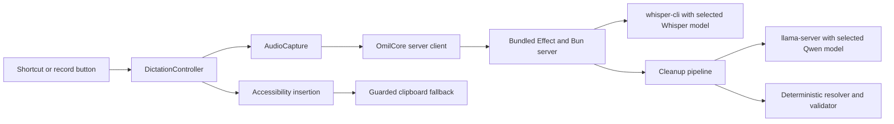

# How Omil works

This document describes the system implemented in this repository. It covers
the primary macOS path and the experimental iOS handoff.

## Runtime overview



The macOS app is the user-facing process. It owns recording, UI state,
shortcuts, insertion, and local history. A bundled server owns model downloads,
transcription, and cleanup. The server calls the Homebrew-installed
`whisper-cli` and `llama-server` binaries.

There is no Swift inference fallback in the Mac app. If the server cannot
transcribe or clean a recording, the app reports the failure and preserves any
raw transcript that was already produced.

## Startup

1. `AppDelegate` creates one shared `DictationController` and starts the global
   hotkey monitor.
2. `LocalServerManager` creates `~/Library/Application Support/Omil/Server`.
3. It creates a bearer token with `0600` permissions and selects free API and
   `llama-server` ports.
4. It launches the bundled `omil-server` executable on `127.0.0.1` and passes
   the app process ID to it. If the user explicitly enables local-network
   sharing, it binds to `0.0.0.0` instead.
5. The app polls `/v1/health`, reads the model catalog, and prepares the selected
   Whisper and Qwen weights when needed.
6. Closing the app terminates the managed server. The server also watches the
   parent process and exits if the app disappears unexpectedly.

The Engine screen can expose the managed server to trusted devices on the same
network. It displays a reachable endpoint and generated bearer token, supports
copying both as one setup block, and can rotate the token. Turning sharing off
restarts the server on loopback. A custom host, port, and token remain available
as an advanced development override.

## Supported models

The Engine screen can select any model in the server catalog:

| Task | Available models | Default |
| --- | --- | --- |
| Transcription | Whisper tiny, base, small, medium, large-v3, large-v3 Q5, large-v3-turbo, large-v3-turbo Q5, large-v3-turbo Q8 | Whisper large-v3-turbo |
| Cleanup | Qwen3 0.6B, Qwen3 4B Instruct, Qwen3 8B, Qwen3.5 0.8B, Qwen3.5 4B, Qwen3.5 9B | Qwen3 4B Instruct |

The defaults are initial selections, not fixed dependencies. Changing a model
saves the selection on the server. The selected weights download separately,
and the next transcription or cleanup uses that model.

## Dictation lifecycle

The controller uses a small set of phases:

```text
idle -> preparing -> recording -> processing -> ready
             |             |            |
             +-------------+------------+-> failed

preparing or recording -> idle (cancel)
```

When recording starts, the app captures the focused accessibility element and
its current selection. `AudioCapture` converts microphone input to 16 kHz,
mono, 16-bit PCM. The floating pill receives a throttled audio level for its
meter, while `ServerTranscriptionBackend` buffers the PCM for the active
session.

Stopping performs the following work:

1. The backend wraps the buffered PCM in a WAV container.
2. It sends the WAV to `POST /v1/transcribe` with the bearer token.
3. The server writes the upload to a temporary directory and runs the selected
   Whisper model through `whisper-cli`.
4. The server returns the transcript and timestamped segments, then deletes the
   temporary upload.
5. The app sends the final transcript, cleanup mode, dictionary, snippets, and
   app-category writing style to `POST /v1/cleanup`.
6. The app inserts the returned text once and records the result in history if
   history is enabled.

The client sends one request identifier through both stages. Each request also
contains its chosen model and a snapshot of its cleanup preferences. The server
has separate FIFO, single-worker queues for Whisper and Qwen work. Requests from
multiple devices therefore run in arrival order for each inference resource,
while transcription and cleanup can progress independently. A queued request
keeps the model and preferences it arrived with even if another client changes
the server defaults before that request starts. `GET /v1/queue` exposes active,
pending, and completed work to authenticated clients.

Each session has its own identifier. Callbacks check that identifier before
changing UI state, so a cancelled or replaced session cannot deliver a late
result. A commit sequence also prevents the same result from being inserted
twice.

## Cleanup pipeline

Verbatim mode normalizes whitespace, capitalization, and final punctuation. It
can also expand an explicit snippet. It does not start Qwen.

Clean mode uses a hybrid pipeline:

1. The server tokenizes the transcript and marks protected values, quoted text,
   fillers, and possible correction cues.
2. Deterministic rules propose filler removal, repeated-word removal,
   corrections, reversals such as "keep the original," and number
   normalization.
3. Qwen proposes only token-referenced repair operations. It does not return a
   free-form rewritten paragraph.
4. The validator rejects stale references, conflicting targets, ungrounded
   replacements, type mismatches, negation changes, and subject-scope changes.
5. A preservation check runs after accepted edits are rendered. If it fails,
   the server drops risky repairs. It falls back to verbatim text if the reduced
   edit set still fails.
6. The server applies the selected writing style and snippet expansions after
   semantic cleanup.

The response includes accepted edits, rejected edits, abstentions, the rule
version, applied snippet triggers, and the final text. The Mac app uses this
data for its raw, cleaned, and diff views.

## Model lifecycle

The server has a catalog of Whisper and Qwen models. A selection is saved before
its weights are downloaded. Model preparation downloads the selected file,
checks its size, calculates a SHA-256 hash, and records that hash in a local
manifest. Later starts verify the stored file against the manifest.

Whisper runs once per completed recording. `llama-server` starts when clean mode
needs Qwen and stays loaded for later requests. The runtime tracks loading,
active uses, deferred unload requests, and failures. Switching Qwen models lets
an active cleanup finish before the old process is released.

Downloaded models can be removed from the Engine screen after confirmation.
The server refuses to delete a model while its inference queue is busy or while
that model is in use. It unloads an idle Qwen process before deleting its
weight, then removes the corresponding manifest entry and lifecycle state.

## Text insertion and recovery

At recording start, `AXInserter` records the destination app, focused field,
selection, and available field value. Before insertion it checks that the same
destination and selection are still active.

If the check succeeds, Omil replaces only the captured selection and stores an
insertion receipt. Undo works only while the inserted range still contains
Omil's text. It refuses to overwrite unrelated typing.

If direct insertion is unavailable, Omil writes the result to the clipboard.
With Accessibility permission it also sends the paste command. The previous
clipboard value is restored only when Omil still owns the clipboard change, so
a newer user copy is never overwritten. Without Accessibility permission, the
result stays copied for manual paste.

If the destination changed while transcription was running, Omil keeps the
result and requires an explicit insertion instead of sending text to the wrong
field.

## Local data

The Mac app stores data under `~/Library/Application Support/Omil`:

| Data | Location |
| --- | --- |
| Dictation history | `history.json`, up to 200 entries when enabled |
| Personal dictionary | `dictionary.json` |
| Snippets | `snippets.json` |
| Model weights and manifest | `Server/models/` |
| Selected models | `Server/selected-models.json` |
| Custom cleanup prompt | `Server/system-prompt.md` |
| Server token and log | `Server/omil-token`, `Server/omil-server.log` |

Theme, shortcut, cleanup, server, and writing-style preferences use
`UserDefaults`. Microphone audio is buffered in memory by the client. The
server deletes its temporary WAV after each transcription request.

The managed server accepts connections only from the local Mac by default.
Every endpoint except `/v1/health` requires the bearer token. Enabling
local-network sharing makes the server reachable on every Mac network
interface; audio, text, and preferences then travel over that local network, so
sharing should only be enabled on a trusted network. Rotating the token
immediately invalidates previously copied credentials.

## iOS and keyboard path

The iOS app is a thin client. The user enables local-network sharing in the Mac
app and copies its endpoint and token into iOS. The iOS app then records audio
and sends it to the same server managed by the Mac app. When a result is ready,
the app writes it to an App Group `ResultStore` with a session identifier.

The keyboard extension never records audio or loads models. It polls the shared
store, inserts one pending result through `textDocumentProxy`, and acknowledges
that session. A second tap cannot insert the same result again.

Shared storage cannot wake a suspended containing app. The current mobile path
therefore requires recording in the Omil app before switching to the keyboard.
It remains experimental until it has been validated on physical devices.

## Source map

| Responsibility | Main code |
| --- | --- |
| Mac lifecycle and settings | `Apps/Mac/OmilMacApp.swift` |
| Recording and delivery orchestration | `Apps/Mac/DictationController.swift` |
| Managed server process | `Apps/Mac/LocalServerManager.swift` |
| Audio capture and server clients | `Sources/OmilCore/AudioCapture.swift`, `Sources/OmilCore/ServerBackend.swift` |
| Safe insertion and clipboard fallback | `Apps/Mac/AXInserter.swift`, `Apps/Mac/ClipboardInserter.swift` |
| HTTP API and authentication | `server/src/Api.ts`, `server/src/Auth.ts` |
| Transcription and model processes | `server/src/Whisper.ts`, `server/src/LlamaServer.ts` |
| Cleanup and validation | `server/src/QwenCleanup.ts`, `server/src/Cleanup.ts`, `server/src/Resolver.ts` |
| Model downloads and runtime state | `server/src/Models.ts`, `server/src/ModelRuntime.ts` |
| Inference scheduling | `server/src/InferenceQueue.ts`, `server/src/Api.ts` |
| Mobile handoff | `Apps/iOS/SessionCoordinator.swift`, `Apps/Keyboard/KeyboardViewController.swift` |
