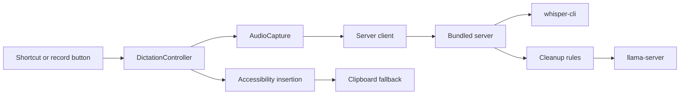

# How Omil works

The Mac app records, shows the UI, and types the result. A small server bundled inside it runs the models. An iPhone or iPad can use the same server over the local network.

```mermaid
flowchart LR
    Input[Shortcut or record button] --> Controller[DictationController]
    Controller --> Capture[AudioCapture]
    Capture --> Client[Server client]
    Client --> API[Bundled server]
    API --> Speech[whisper-cli]
    API --> Cleanup[Cleanup rules]
    Cleanup --> LLM[llama-server]
    Controller --> Insert[Accessibility insertion]
    Insert --> Clipboard[Clipboard fallback]
```

The server calls two Homebrew tools: `whisper-cli` from `whisper.cpp` for speech, and `llama-server` from `llama.cpp` for cleanup. The app has no other way to transcribe. If the server fails, the app says so and keeps any raw transcript it already has.

## Startup

1. `AppDelegate` creates one `DictationController` and starts the global shortcut monitor.
2. `LocalServerManager` creates `~/Library/Application Support/Omil/Server`, writes a bearer token with `0600` permissions, and picks free ports.
3. It launches `omil-server` on `127.0.0.1` and passes it the app's process ID.
4. If `whisper-cli` or `llama-server` is missing, the app runs Homebrew to install it. If that fails, the Engine screen shows the install page and a command to run.
5. The app polls `/v1/health`, reads the model catalog, downloads the selected weights if needed, and loads the cleanup model in the background.

Quitting the app stops the server. The server also watches the app's process and exits if it disappears.

## Models

Speech: Whisper small Q8 or large-v3 turbo Q8. Cleanup: Qwen3.5 0.8B, 2B, or 4B at Q4. The defaults are large-v3 turbo Q8 and Qwen3.5 2B. Models are catalog entries, so adding one does not change anything else here.

Each request names the model it wants. Weights download after you select a model. The server checks the file size, records a SHA-256 hash in a local manifest, and verifies the file against it on later starts. It also downloads a small Silero voice-detection model the first time it transcribes.

Speech runs once per recording. The cleanup model loads the first time Clean mode needs it and stays loaded. Switching models lets a running cleanup finish first. You can delete a downloaded model from the Engine screen, but not while it is in use.

## A dictation, step by step

When recording starts, the app notes the focused field and its selection. `AudioCapture` converts the microphone input to 16 kHz mono 16-bit PCM. The pill gets a throttled level for its meter.

When recording stops:

1. The app wraps the audio in a WAV and sends it to `POST /v1/transcribe`.
2. The server filters low-frequency rumble and raises quiet speech. Near-silent audio returns an empty transcript. This is a high-pass filter and a level adjustment, not noise removal.
3. Silero voice activity detection keeps the speech segments, and Whisper transcribes them.
4. The server returns the transcript with timestamps and deletes the upload.
5. The app sends the transcript, mode, dictionary, snippets, and writing style to `POST /v1/cleanup`. A device's own cleanup prompt, if set, applies to that request only.
6. The app inserts the result once and saves it to history.

Stopping frees the microphone at once, so you can record again while older recordings are still processing. Results are delivered in the order they were recorded.

The server has one queue for speech and one for cleanup, each with a single worker. Requests from several devices run in arrival order. A queued request keeps the model and settings it arrived with. `GET /v1/queue` shows what is running and waiting.

Each recording has its own ID. A cancelled or replaced recording cannot deliver a late result, and a result cannot be inserted twice.

### Speech sensitivity

Each device sends its own setting with every request.

| Setting | VAD threshold | Max gain | Min speech | Min silence | Padding |
| --- | ---: | ---: | ---: | ---: | ---: |
| Filter more noise | 0.65 | 2x | 250 ms | 100 ms | 30 ms |
| Balanced | 0.50 | 3x | 250 ms | 100 ms | 30 ms |
| Distant voice | 0.30 | 5x | 120 ms | 450 ms | 90 ms |

A lower threshold keeps more quiet speech and lets in more background sound. Gain cannot recover speech that is buried in noise.

## Cleanup

Verbatim mode fixes whitespace, capitalization, and final punctuation, and expands snippets. It does not use the cleanup model.

Clean mode runs rules first and the model second:

1. The server splits the transcript into tokens and marks protected values, quoted text, fillers, and correction cues.
2. Rules propose edits: remove fillers and repeated words, apply corrections and reversals such as "keep the original", and write numbers of ten or more as digits.
3. A validator rejects edits that point at the wrong words, conflict with each other, change a negation, or change who the sentence is about.
4. The accepted edits are applied and checked. If the check fails, the server drops the risky edits. If it still fails, it returns the verbatim text.
5. Dictionary entries are substituted. Then one model call copyedits the whole text for grammar, spelling, capitalization, and punctuation. It sees up to 400 characters before the cursor and 200 after, as context only.
6. A word diff checks the copyedit. If it changed a number, a negation, quoted text, or added content, the server keeps the text from step 4.
7. The writing style and snippets are applied.

The response lists the accepted and rejected edits, the snippets used, and the final text. The app's Clean, Original, and Changes views are built from it.

## Typing the result

`AXInserter` records the app, field, and selection when recording starts. Before inserting, it checks that the same field and selection are still active.

- If they are, Omil replaces only that selection. Undo works while the inserted text is still there, and never overwrites other typing.
- If direct insertion fails, Omil saves the clipboard, pastes, and restores the clipboard. It does not restore if you copied something else in the meantime.
- If the field changed while Omil was working, the result stays in Omil until you insert it yourself.
- Without Accessibility permission, the result stays in Omil for copying.

## Data on disk

Everything is under `~/Library/Application Support/Omil`.

| Data | Location |
| --- | --- |
| History, up to 200 entries | `history.json` |
| Dictionary | `dictionary.json` |
| Snippets | `snippets.json` |
| Model weights and manifest | `Server/models/` |
| Selected models | `Server/selected-models.json` |
| Server-wide cleanup prompt | `Server/system-prompt.md` |
| Server token and log | `Server/omil-token`, `Server/omil-server.log` |

Other preferences are in `UserDefaults`. Audio is held in memory by the app. The server deletes its temporary WAV after each request.

## Network

By default the server accepts connections only from the Mac itself. Every endpoint except `/v1/health` needs the bearer token.

Turning on local-network sharing in the Engine screen binds the server to every network interface. Audio and text then travel over that network, so only do this on a network you trust. The screen shows the address and token to copy to another device. Rotating the token cuts off devices that have the old one. Turning sharing off restarts the server on loopback.

## iPhone and iPad

This path is experimental. It has not been tested on a physical device.

The iOS app records audio and sends it to the Mac's server, using the address and token from the Engine screen. It writes each result to an App Group `ResultStore`.

A keyboard extension cannot use the microphone, so the keyboard drives the app through `KeyboardLink`: two small JSON files in the App Group container, plus Darwin notifications to wake the other side.

1. The first tap on the keyboard's mic opens the app with `omil://dictate`. The app starts listening, and you return to your app with the system's back button.
2. The app keeps the audio engine running in the background for 1, 5, 15, or 60 minutes after the last dictation. Audio is only kept while a dictation is running.
3. While the app is alive, the keyboard sends `start`, `stop`, `cancel`, and `end`, and shows the live waveform. The app writes a heartbeat every second. If it goes stale, the next tap opens the app again.
4. The keyboard inserts results it started as soon as they are ready, once. Results started in the app wait for an Insert tap.
5. After inserting, Omil can switch back to your usual keyboard.

A phone call or Siri ends the session. What was already said is kept.

## Where the code is

| Area | Files |
| --- | --- |
| Mac app lifecycle and settings | `Apps/Mac/OmilMacApp.swift` |
| Recording and delivery | `Apps/Mac/DictationController.swift` |
| Server process | `Apps/Mac/LocalServerManager.swift` |
| Audio capture and server client | `Sources/OmilCore/AudioCapture.swift`, `Sources/OmilCore/ServerBackend.swift` |
| Insertion and clipboard fallback | `Apps/Mac/AXInserter.swift`, `Apps/Mac/ClipboardInserter.swift` |
| HTTP API and auth | `server/src/Api.ts`, `server/src/Auth.ts` |
| Speech and model processes | `server/src/Whisper.ts`, `server/src/LlamaServer.ts` |
| Cleanup and validation | `server/src/QwenCleanup.ts`, `server/src/Cleanup.ts`, `server/src/Resolver.ts` |
| Model downloads and state | `server/src/Models.ts`, `server/src/ModelRuntime.ts` |
| Queues | `server/src/InferenceQueue.ts` |
| iOS and keyboard | `Apps/iOS/SessionCoordinator.swift`, `Apps/Keyboard/KeyboardViewController.swift`, `Sources/OmilCore/KeyboardLink.swift` |
